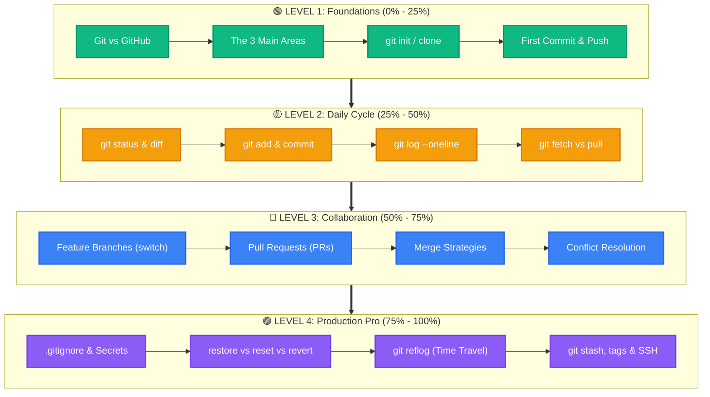
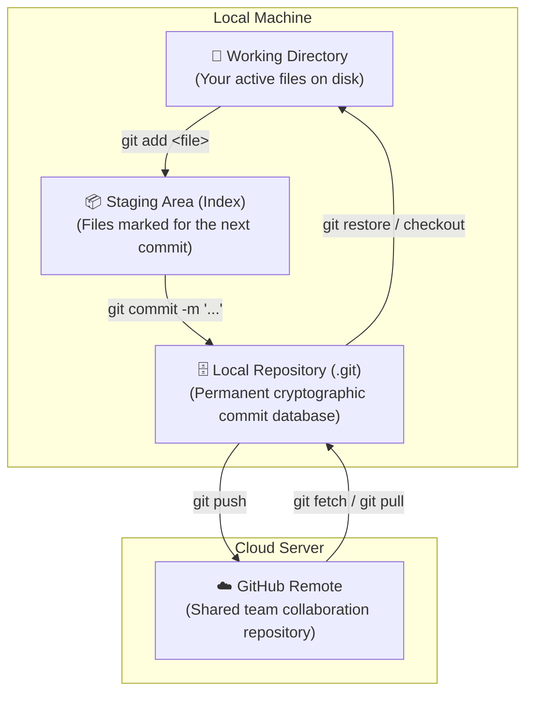
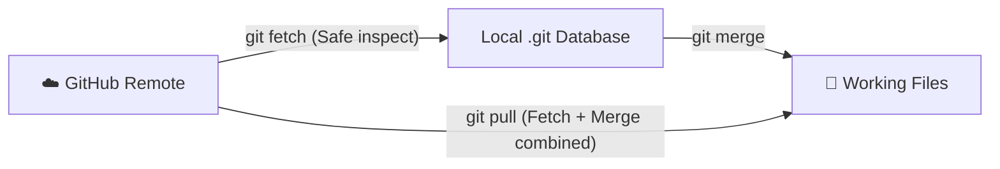
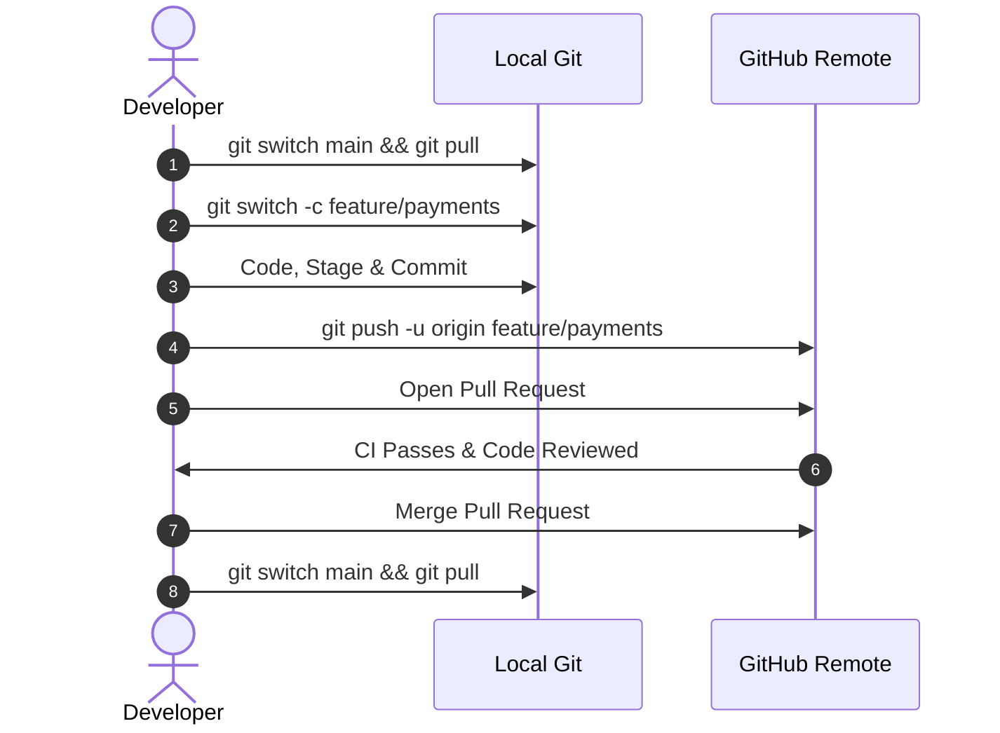

<div align="center">

# ⚡ Git & GitHub: Zero to Hero (0 → 100)
### 🚀 *Git & GitHub Practical Guide*

<br/>

<!-- DYNAMIC REPO VISITOR COUNTER BADGES -->
[](https://github.com/rishad0x/git-github-guide)
[](https://github.com/rishad0x/git-github-guide)
[](https://github.com/rishad0x/git-github-guide/pulls)
[](https://opensource.org/licenses/MIT)

<br/>

[](https://git-scm.com/)
[](https://github.com/rishad0x/git-github-guide)
[](https://code.visualstudio.com/)
[](#-the-0-to-100-skill-progression)
[](#-table-of-contents)
[](#-emergency-cheat-sheet-dont-panic)

<br/>

> **"Stop memorizing Git commands like magic spells. Master the underlying mental model, and you will never fear a merge conflict, detached HEAD, or corrupted branch again."**

<br/>

---

### 🎛️ Interactive Navigation Matrix

| 🟢 [Level 1: Foundations (0-25%)](#-level-1-foundations--mental-model-0--25) | 🟡 [Level 2: Daily Cycle (25-50%)](#-level-2-the-daily-developer-cycle-25--50) |
| :---: | :---: |
| 🧠 Mental Model • 3 Git Areas • Commits • Remote Linking | 🔄 Daily Loop • Diffs • Logs • Fetch vs Pull |
| **🔵 [Level 3: Collaboration (50-75%)](#-level-3-branches-prs--team-collaboration-50--75)** | **🟣 [Level 4: Pro Mastery (75-100%)](#-level-4-pro-mastery--disaster-recovery-75--100)** |
| 🌿 Feature Branches • PR Lifecycle • Conflict Resolution | ⏳ Time Travel • Reflog • Undo Secrets • Stashing |

<br/>

[📋 Full Table of Contents](#-table-of-contents) • 
[🚨 Emergency Cheat Sheet](#86-emergency-cheat-sheet-dont-panic) • 
[⭐ Top 10 First Commands](#the-essential-10-commands-to-master-first)

---

</div>

<br/>

## 📈 The 0 to 100 Skill Progression

```text
[ 0% ] ─── 🟢 Level 1: Foundations ──────> [ 25% ]
           Understanding 3 Areas, Repo Setup, First Commits & Remote

[ 25% ] ── 🟡 Level 2: Daily Developer ───> [ 50% ]
           Status Inspection, Diffs, Logs, Safe Push/Pull Cycle

[ 50% ] ── 🔵 Level 3: Team Collaboration ─> [ 75% ]
           Feature Branching, PR Reviews, Squash & Conflict Resolution

[ 75% ] ── 🟣 Level 4: Pro Engineer ─────> [ 100% ]
           Reflog Recovery, Revert vs Reset, Stash, Tags & Leaked Secrets
```

<br/>



---

## 📚 Table of Contents

<details open>
<summary><b>📖 Click to Toggle Table of Contents (86 Topics)</b></summary>

<br/>

#### 🟢 [Level 1: Foundations & Mental Model (0% → 25%)](#-level-1-foundations--mental-model-0--25)
* [1. Git vs GitHub](#1-git-vs-github)
* [2. How Git Actually Works (The Architecture)](#2-how-git-actually-works-the-architecture)
* [3. Important Git Terms (Glossary)](#3-important-git-terms-glossary)
* [4. The Three Main Areas (Working, Staging, Local Repo)](#4-the-three-main-areas)
* [5. Understanding Commits & SHA Hashes](#5-understanding-commits--sha-hashes)
* [6. Understanding `origin`](#6-understanding-origin)
* [7. Understanding `main`](#7-understanding-main)
* [8. Clone an Existing Repository](#8-clone-an-existing-repository)
* [9. Create a Git Repository From an Existing Project](#9-create-a-git-repository-from-an-existing-project)
* [10. Connect Local Project to GitHub](#10-connect-local-project-to-github)
* [11. First Push & Upstream Tracking (`-u`)](#11-first-push--upstream-tracking--u)

#### 🟡 [Level 2: The Daily Developer Cycle (25% → 50%)](#-level-2-the-daily-developer-cycle-25--50)
* [12. Check Repository Status (`git status`)](#12-check-repository-status-git-status)
* [13. Pull Changes Safely](#13-pull-changes-safely)
* [14. Making Changes in Code](#14-making-changes-in-code)
* [15. Staging Changes (`git add`)](#15-staging-changes-git-add)
* [16. Committing Changes with Impact](#16-committing-changes-with-impact)
* [17. Pushing Changes](#17-pushing-changes)
* [18. The Complete Daily Golden Workflow](#18-the-complete-daily-golden-workflow)
* [19. GitHub Website Changes → Local](#19-github-website-changes--local)
* [20. Local Changes → GitHub](#20-local-changes--github)
* [21. Fetch vs Pull Demystified](#21-fetch-vs-pull-demystified)
* [22. Check Remote Repositories](#22-check-remote-repositories)
* [23. Change or Update Remote URLs](#23-change-or-update-remote-urls)
* [45. View Commit History (`git log`)](#45-view-commit-history-git-log)
* [46. View Changes with Diffs (`git diff`)](#46-view-changes-with-diffs-git-diff)
* [47. Compare Commits](#47-compare-commits)
* [48. Find Who Changed a Line (`git blame`)](#48-find-who-changed-a-line-git-blame)
* [49. Inspect a Specific Commit (`git show`)](#49-inspect-a-specific-commit-git-show)

#### 🔵 [Level 3: Branches, PRs & Team Collaboration (50% → 75%)](#-level-3-branches-prs--team-collaboration-50--75)
* [24. What Is a Branch?](#24-what-is-a-branch)
* [25. Create a Branch (`git switch -c`)](#25-create-a-branch-git-switch--c)
* [26. Switch Between Branches](#26-switch-between-branches)
* [27. List Local & Remote Branches](#27-list-local--remote-branches)
* [28. Push a Branch to Remote](#28-push-a-branch-to-remote)
* [29. Merge Branches Locally](#29-merge-branches-locally)
* [30. Safely Delete Local & Remote Branches](#30-safely-delete-local--remote-branches)
* [31. Production Feature Branch Workflow](#31-production-feature-branch-workflow)
* [32. What Is a Pull Request (PR)?](#32-what-is-a-pull-request-pr)
* [33. How to Create a Pull Request](#33-how-to-create-a-pull-request)
* [34. How to Review a Pull Request](#34-how-to-review-a-pull-request)
* [35. Merge Strategies (Merge Commit vs Squash vs Rebase)](#35-merge-strategies-merge-commit-vs-squash-vs-rebase)
* [36. Post-PR Cleanup Routine](#36-post-pr-cleanup-routine)
* [37. What Causes a Merge Conflict?](#37-what-causes-a-merge-conflict)
* [38. Step-by-Step Merge Conflict Resolution](#38-step-by-step-merge-conflict-resolution)
* [39. How to Abort a Merge Cleanly](#39-how-to-abort-a-merge-cleanly)
* [40. How to Avoid Merge Conflicts](#40-how-to-avoid-merge-conflicts)
* [64. What Is a Fork?](#64-what-is-a-fork)
* [65. Open Source Fork Workflow](#65-open-source-fork-workflow)
* [66. Managing Upstream Repositories](#66-managing-upstream-repositories)

#### 🟣 [Level 4: Pro Mastery & Disaster Recovery (75% → 100%)](#-level-4-pro-mastery--disaster-recovery-75--100)
* [41. What Is `.gitignore`?](#41-what-is-gitignore)
* [42. Common Production `.gitignore` Rules](#42-common-production-gitignore-rules)
* [43. Stop Tracking Already-Committed Files](#43-stop-tracking-already-committed-files)
* [44. Secrets and Sensitive Files](#44-secrets-and-sensitive-files)
* [50. Undo Uncommitted File Changes (`git restore`)](#50-undo-uncommitted-file-changes-git-restore)
* [51. Unstage Staged Files (`git restore --staged`)](#51-unstage-staged-files-git-restore---staged)
* [52. Undo a Commit Safely (`git revert`)](#52-undo-a-commit-safely-git-revert)
* [53. The Ultimate Showdown: `restore` vs `reset` vs `revert`](#53-the-ultimate-showdown-restore-vs-reset-vs-revert)
* [54. How to Undo a Pushed Commit](#54-how-to-undo-a-pushed-commit)
* [55. Recover Lost Work Using `git reflog`](#55-recover-lost-work-using-git-reflog)
* [56. What Is Git Stash?](#56-what-is-git-stash)
* [57. Stash Your Work in Progress](#57-stash-your-work-in-progress)
* [58. Apply & Pop Stashes](#58-apply--pop-stashes)
* [59. Inspect & Delete Stashes](#59-inspect--delete-stashes)
* [60. What Is a Git Tag?](#60-what-is-a-git-tag)
* [61. Create Semantic Tags](#61-create-semantic-tags)
* [62. Push Tags to Remote](#62-push-tags-to-remote)
* [63. Publishing GitHub Releases](#63-publishing-github-releases)
* [67. HTTPS vs SSH Authentication](#67-https-vs-ssh-authentication)
* [68. Switching Remote URL to SSH](#68-switching-remote-url-to-ssh)
* [69. Repository Diagnostics & State](#69-repository-diagnostics--state)
* [70. Clean Untracked Files Safely (`git clean`)](#70-clean-untracked-files-safely-git-clean)
* [71. Rename Files with Git](#71-rename-files-with-git)
* [72. Delete Files with Git](#72-delete-files-with-git)

#### 🚨 [Troubleshooting, Mental Models & Cheat Sheets](#-troubleshooting-mental-models--cheat-sheets)
* [73. `! [rejected] (fetch first)`](#73-error-rejected-main---main-fetch-first)
* [74. `rejected non-fast-forward`](#74-error-rejected-non-fast-forward)
* [75. `nothing to commit, working tree clean`](#75-notice-nothing-to-commit-working-tree-clean)
* [76. `fatal: not a git repository`](#76-error-fatal-not-a-git-repository)
* [77. `HEAD detached at ...`](#77-notice-head-detached-at-)
* [78. Merge Conflict in PR or CLI](#78-merge-conflict-in-pr-or-cli)
* [79. 🚨 Disaster Protocol: Leaked Secret Pushed](#79--disaster-protocol-accidentally-committed-a-secret)
* [80. Mental Model: How Senior Engineers Think About Git](#80-mental-model-how-senior-engineers-think-about-git)
* [81. Safe vs Dangerous Command Matrix](#81-safe-vs-dangerous-command-matrix)
* [82. Professional Conventional Commit Standards](#82-professional-conventional-commit-standards)
* [83. The Production Engineering Workflow](#83-the-production-engineering-workflow)
* [84. Top Commands Reference Card](#84-top-commands-reference-card)
* [85. Daily Developer Cheat Sheet](#85-daily-developer-cheat-sheet)
* [86. Emergency Cheat Sheet (Don't Panic!)](#86-emergency-cheat-sheet-dont-panic)
* [🧭 The Architecture Diagram to Memorize](#the-architecture-diagram-to-memorize)
* [⭐ The Essential 10 Commands to Master First](#the-essential-10-commands-to-master-first)

</details>

---

## 🟢 LEVEL 1: Foundations & Mental Model (0% → 25%)

### <a id="1-git-vs-github"></a>1. Git vs GitHub

Beginners often confuse the two. Here is the architectural distinction:

| Criterion | 💻 Git (Local Tool) | ☁️ GitHub (Cloud Service) |
| :--- | :--- | :--- |
| **What is it?** | Distributed Version Control CLI software installed locally. | Web platform that hosts remote Git repositories. |
| **Where it runs?** | Directly on your local OS (macOS, Windows, Linux). | High-availability cloud servers managed by GitHub. |
| **Network needed?**| ❌ No. 100% functional offline on flights or without internet. | ✅ Yes. Requires network access to view or push/pull. |
| **Primary purpose** | Snapshotting files, branches, staging, local history. | Code hosting, Pull Requests, Issue trackers, Actions CI/CD. |

> [!TIP]
> **The Real-World Metaphor:**  
> **Git** is the high-precision camera in your hands that captures snapshots of code.  
> **GitHub** is the cloud album where you share and collaborate on those photos with your team.

[⬆ Back to Top](#-git--github-zero-to-hero-0--100)

---

### <a id="2-how-git-actually-works-the-architecture"></a>2. How Git Actually Works (The Architecture)

Git does not record messy diff patches. **Git stores full snapshots of your files at given moments in time.**



> [!IMPORTANT]
> Simply saving a file in VS Code (`Ctrl + S` or `Cmd + S`) **does not** create a Git commit! Git only registers changes when you explicitly stage (`git add`) and seal them into history (`git commit`).

[⬆ Back to Top](#-git--github-zero-to-hero-0--100)

---

### <a id="3-important-git-terms-glossary"></a>3. Important Git Terms (Glossary)

| Term | Professional Definition |
| :--- | :--- |
| **Repository (Repo)** | The root project folder tracked by Git (contains the hidden `.git/` database). |
| **Commit** | An immutable, timestamped cryptographic snapshot of your staged files. |
| **Branch** | An ultra-lightweight movable pointer to a specific commit. |
| **Remote** | A version of your repository hosted on the cloud or external server. |
| **`origin`** | The default alias Git gives to your primary remote repository URL. |
| **`main`** | The default production branch of your codebase (formerly `master`). |
| **Clone** | Downloading a full remote repository (all files + entire history) to your computer. |
| **Pull** | Downloading remote commits and instantly merging them into your branch (`fetch` + `merge`). |
| **Fetch** | Downloading remote commits without touching your working files. |
| **Push** | Uploading your local commits to a remote repository. |
| **Merge** | Combining code histories from two branches into one. |
| **Stash** | A temporary clipboard where you can shelve uncommitted work. |
| **Tag** | A frozen, permanent label attached to a specific commit (e.g. `v1.0.0`). |
| **Fork** | A server-side clone of someone else's GitHub repository created under your own account. |
| **HEAD** | A pointer pointing to the branch or commit you currently have checked out. |

[⬆ Back to Top](#-git--github-zero-to-hero-0--100)

---

### <a id="4-the-three-main-areas"></a>4. The Three Main Areas

Understanding the 3 areas is the core breakthrough for developers:

```text
┌─────────────────────────────────┐
│     1. Working Directory        │ ── Unstaged / modified files on disk
└─────────────────────────────────┘
                 │
                 ▼  git add <file>
┌─────────────────────────────────┐
│     2. Staging Area (Index)     │ ── The curated "shopping cart" ready for commit
└─────────────────────────────────┘
                 │
                 ▼  git commit -m "..."
┌─────────────────────────────────┐
│     3. Local Repository (.git)  │ ── The permanent history log on your machine
└─────────────────────────────────┘
```

[⬆ Back to Top](#-git--github-zero-to-hero-0--100)

---

### <a id="5-understanding-commits--sha-hashes"></a>5. Understanding Commits & SHA Hashes

A commit is an immutable node in Git's history graph:

```text
[Commit 1] ───> [Commit 2] ───> [Commit 3]
  aabf014         3574d9f         89e4c12
```

Each commit contains:
1. Exact file tree snapshots
2. Author name, email & timestamp
3. Descriptive commit message
4. Parent commit reference
5. A unique 40-character SHA-1 checksum (e.g. `aabf014...`)

```bash
# View recent commits in clean single-line format:
git log --oneline
```

[⬆ Back to Top](#-git--github-zero-to-hero-0--100)

---

### <a id="6-understanding-origin"></a>6. Understanding `origin`

`origin` is simply a friendly nickname for your GitHub repository URL.

Instead of typing:
```bash
git push https://github.com/myusername/mycoolproject.git main
```
Git allows you to type:
```bash
git push origin main
```

[⬆ Back to Top](#-git--github-zero-to-hero-0--100)

---

### <a id="7-understanding-main"></a>7. Understanding `main`

* **`main`**: Your local branch on your machine.
* **`origin/main`**: A remote tracking pointer reflecting what GitHub had during your last sync.

[⬆ Back to Top](#-git--github-zero-to-hero-0--100)

---

### <a id="8-clone-an-existing-repository"></a>8. Clone an Existing Repository

To download an existing project from GitHub:

```bash
git clone https://github.com/USERNAME/REPOSITORY.git
cd REPOSITORY
```

*Example:*
```bash
git clone https://github.com/USERNAME/my-project.git
cd my-project
```

[⬆ Back to Top](#-git--github-zero-to-hero-0--100)

---

### <a id="9-create-a-git-repository-from-an-existing-project"></a>9. Create a Git Repository From an Existing Project

Turn any local project folder into a Git repository:

```bash
cd my-project
git init
git add .
git commit -m "chore: initial project setup"
```

[⬆ Back to Top](#-git--github-zero-to-hero-0--100)

---

### <a id="10-connect-local-project-to-github"></a>10. Connect Local Project to GitHub

1. Create a new empty repository on [github.com/new](https://github.com/new).
2. Connect your local repository to GitHub:

```bash
git remote add origin https://github.com/USERNAME/REPOSITORY.git
git remote -v
```

[⬆ Back to Top](#-git--github-zero-to-hero-0--100)

---

### <a id="11-first-push--upstream-tracking--u"></a>11. First Push & Upstream Tracking (`-u`)

Ensure your branch is named `main`:
```bash
git branch -M main
```

Push and bind the upstream tracking link:
```bash
git push -u origin main
```

> [!TIP]
> The `-u` (`--set-upstream`) flag links your local `main` branch to GitHub's `origin/main`. For every future push, you simply type:
> ```bash
> git push
> ```

[⬆ Back to Top](#-git--github-zero-to-hero-0--100)

---

## 🟡 LEVEL 2: The Daily Developer Cycle (25% → 50%)

### <a id="12-check-repository-status-git-status"></a>12. Check Repository Status (`git status`)

```bash
git status
```

**Pro Tip:** Run this before and after *every* action. It reveals:
* Your current branch name.
* Files that have been modified.
* Files staged in the index (green).
* New untracked files (red).
* Ahead / behind sync metrics with GitHub.

[⬆ Back to Top](#-git--github-zero-to-hero-0--100)

---

### <a id="13-pull-changes-safely"></a>13. Pull Changes Safely

Always sync upstream changes before writing new code:

```bash
git pull origin main
```
Or simply:
```bash
git pull
```

[⬆ Back to Top](#-git--github-zero-to-hero-0--100)

---

### <a id="14-making-changes-in-code"></a>14. Making Changes in Code

Modify or create files inside your IDE:
```bash
# E.g., editing src/index.js or README.md
git status
```
Git highlights your modified files in red under *"Changes not staged for commit"*.

[⬆ Back to Top](#-git--github-zero-to-hero-0--100)

---

### <a id="15-staging-changes-git-add"></a>15. Staging Changes (`git add`)

```bash
# Stage ALL modified and new files:
git add .

# Stage an individual file:
git add src/auth.js

# Stage multiple specific files:
git add src/auth.js config.json
```

[⬆ Back to Top](#-git--github-zero-to-hero-0--100)

---

### <a id="16-committing-changes-with-impact"></a>16. Committing Changes with Impact

```bash
git commit -m "feat(auth): implement token refresh rotation"
```

> [!NOTE]
> Industry-standard teams use **Conventional Commits**:
> * `feat:` New user-facing feature
> * `fix:` Bug fix
> * `docs:` Documentation change
> * `refactor:` Code refactoring without behavior change
> * `test:` Adding or fixing unit/integration tests
> * `chore:` Build scripts or dependency updates

[⬆ Back to Top](#-git--github-zero-to-hero-0--100)

---

### <a id="17-pushing-changes"></a>17. Pushing Changes

Upload your local commits to GitHub:

```bash
git push
```

[⬆ Back to Top](#-git--github-zero-to-hero-0--100)

---

### <a id="18-the-complete-daily-golden-workflow"></a>18. The Complete Daily Golden Workflow

Memorize this 6-step loop:

```text
┌────────────────────────────────────────────────────────┐
│ 1. git pull                     (Sync upstream)        │
│ 2. [Write code & test]          (Do your engineering)  │
│ 3. git status                   (Inspect modified)     │
│ 4. git add .                    (Stage changes)        │
│ 5. git commit -m "feat: ..."    (Seal snapshot)        │
│ 6. git push                     (Publish to cloud)     │
└────────────────────────────────────────────────────────┘
```

[⬆ Back to Top](#-git--github-zero-to-hero-0--100)

---

### <a id="19-github-website-changes--local"></a>19. GitHub Website Changes → Local

If you or a collaborator made edits directly on GitHub's website (e.g. updating `README.md`):

```bash
git pull origin main
```

[⬆ Back to Top](#-git--github-zero-to-hero-0--100)

---

### <a id="20-local-changes--github"></a>20. Local Changes → GitHub

After editing files locally:

```bash
git add .
git commit -m "docs: update API setup instructions"
git push
```

[⬆ Back to Top](#-git--github-zero-to-hero-0--100)

---

### <a id="21-fetch-vs-pull-demystified"></a>21. Fetch vs Pull Demystified



* **`git fetch`**: Downloads remote commits without modifying your active files. Completely safe to run anytime.
* **`git pull`**: Performs `git fetch` followed immediately by `git merge`. Modifies your working files directly.

[⬆ Back to Top](#-git--github-zero-to-hero-0--100)

---

### <a id="22-check-remote-repositories"></a>22. Check Remote Repositories

```bash
git remote -v
```

Output:
```text
origin  https://github.com/USERNAME/my-project.git (fetch)
origin  https://github.com/USERNAME/my-project.git (push)
```

[⬆ Back to Top](#-git--github-zero-to-hero-0--100)

---

### <a id="23-change-or-update-remote-urls"></a>23. Change or Update Remote URLs

```bash
# Update existing remote URL directly:
git remote set-url origin https://github.com/NEW_USER/NEW_REPO.git

# Verify:
git remote -v
```

[⬆ Back to Top](#-git--github-zero-to-hero-0--100)

---

### <a id="45-view-commit-history-git-log"></a>45. View Commit History (`git log`)

```bash
# Clean one-line overview:
git log --oneline

# Last 5 commits with file change statistics:
git log --oneline -5 --stat

# Visual tree graph with branches and tags:
git log --oneline --graph --decorate --all
```

[⬆ Back to Top](#-git--github-zero-to-hero-0--100)

---

### <a id="46-view-changes-with-diffs-git-diff"></a>46. View Changes with Diffs (`git diff`)

```bash
# View changes that are NOT yet staged:
git diff

# View changes that ARE staged (ready to commit):
git diff --staged
```

[⬆ Back to Top](#-git--github-zero-to-hero-0--100)

---

### <a id="47-compare-commits"></a>47. Compare Commits

Compare changes between two specific commits:

```bash
git diff aabf014 3574d9f
```

[⬆ Back to Top](#-git--github-zero-to-hero-0--100)

---

### <a id="48-find-who-changed-a-line-git-blame"></a>48. Find Who Changed a Line (`git blame`)

Find who authored each line, when, and in which commit:

```bash
git blame src/utils.js
```

[⬆ Back to Top](#-git--github-zero-to-hero-0--100)

---

### <a id="49-inspect-a-specific-commit-git-show"></a>49. Inspect a Specific Commit (`git show`)

```bash
git show aabf014
```

[⬆ Back to Top](#-git--github-zero-to-hero-0--100)

---

## 🔵 LEVEL 3: Branches, PRs & Team Collaboration (50% → 75%)

### <a id="24-what-is-a-branch"></a>24. What Is a Branch?

A branch isolates your new code completely from production code:

```text
main:       ●──────●──────●──────────●─── (Stable, Production Ready)
                    \                /
feature:             ●──────●───────●     (Feature Development & Tests)
```

[⬆ Back to Top](#-git--github-zero-to-hero-0--100)

---

### <a id="25-create-a-branch-git-switch--c"></a>25. Create a Branch (`git switch -c`)

Modern Git uses `switch`:

```bash
git switch -c feature/extractor-fix
```

*(Legacy equivalent: `git checkout -b feature/extractor-fix`)*

[⬆ Back to Top](#-git--github-zero-to-hero-0--100)

---

### <a id="26-switch-between-branches"></a>26. Switch Between Branches

```bash
# Switch to main:
git switch main

# Switch to feature branch:
git switch feature/extractor-fix
```

[⬆ Back to Top](#-git--github-zero-to-hero-0--100)

---

### <a id="27-list-local--remote-branches"></a>27. List Local & Remote Branches

```bash
# List local branches (* marks active branch):
git branch

# List all branches including GitHub remotes:
git branch -a
```

[⬆ Back to Top](#-git--github-zero-to-hero-0--100)

---

### <a id="28-push-a-branch-to-remote"></a>28. Push a Branch to Remote

```bash
git push -u origin feature/extractor-fix
```

[⬆ Back to Top](#-git--github-zero-to-hero-0--100)

---

### <a id="29-merge-branches-locally"></a>29. Merge Branches Locally

To merge a feature branch into `main`:

```bash
# 1. Switch to target branch:
git switch main

# 2. Update target branch:
git pull

# 3. Merge feature branch:
git merge feature/extractor-fix

# 4. Push updated main to GitHub:
git push
```

[⬆ Back to Top](#-git--github-zero-to-hero-0--100)

---

### <a id="30-safely-delete-local--remote-branches"></a>30. Safely Delete Local & Remote Branches

After merging:

```bash
# Delete local branch (safe - warns if unmerged):
git branch -d feature/extractor-fix

# Force delete local branch:
git branch -D feature/extractor-fix

# Delete remote branch on GitHub:
git push origin --delete feature/extractor-fix
```

[⬆ Back to Top](#-git--github-zero-to-hero-0--100)

---

### <a id="31-production-feature-branch-workflow"></a>31. Production Feature Branch Workflow



[⬆ Back to Top](#-git--github-zero-to-hero-0--100)

---

### <a id="32-what-is-a-pull-request-pr"></a>32. What Is a Pull Request (PR)?

A Pull Request is a GitHub collaboration feature. You are asking: *"I finished this feature on my branch. Can the team please review, run automated tests, and pull these changes into `main`?"*

[⬆ Back to Top](#-git--github-zero-to-hero-0--100)

---

### <a id="33-how-to-create-a-pull-request"></a>33. How to Create a Pull Request

1. Push your branch: `git push -u origin feature/new-button`
2. Open your repository on GitHub.
3. Click the yellow banner: **"Compare & pull request"**.
4. Set **base** (`main`) $\leftarrow$ **compare** (`feature/new-button`).
5. Write a concise summary and click **Create pull request**.

[⬆ Back to Top](#-git--github-zero-to-hero-0--100)

---

### <a id="34-how-to-review-a-pull-request"></a>34. How to Review a Pull Request

On GitHub's PR page:
1. Open the **Files changed** tab.
2. Review line-by-line diffs (green = added, red = removed).
3. Leave inline comments or approve the PR.

[⬆ Back to Top](#-git--github-zero-to-hero-0--100)

---

### <a id="35-merge-strategies-merge-commit-vs-squash-vs-rebase"></a>35. Merge Strategies (Merge Commit vs Squash vs Rebase)

| Strategy | When to use | Result in History |
| :--- | :--- | :--- |
| **Squash and Merge** ⭐ *(Most Popular)* | Feature branches with messy "wip", "fixed typo" commits. | Combines all branch commits into **one clean commit** on `main`. |
| **Rebase and Merge** | Teams requiring a strictly linear Git history without merge bubbles. | Commits are re-applied one-by-one onto `main`. |
| **Create a Merge Commit** | Long-running branches or releases requiring explicit audit trail. | Retains all branch commits plus an explicit merge commit. |

[⬆ Back to Top](#-git--github-zero-to-hero-0--100)

---

### <a id="36-post-pr-cleanup-routine"></a>36. Post-PR Cleanup Routine

Once your PR is merged on GitHub:

```bash
# 1. Switch to main
git switch main

# 2. Pull the newly merged code
git pull

# 3. Clean up the local branch
git branch -d feature/new-button
```

[⬆ Back to Top](#-git--github-zero-to-hero-0--100)

---

### <a id="37-what-causes-a-merge-conflict"></a>37. What Causes a Merge Conflict?

A conflict happens when two developers modify the **exact same line** of code differently, and Git cannot automatically determine whose version takes precedence.

[⬆ Back to Top](#-git--github-zero-to-hero-0--100)

---

### <a id="38-step-by-step-merge-conflict-resolution"></a>38. Step-by-Step Merge Conflict Resolution

1. Git alerts you: `CONFLICT (content): Merge conflict in app.js`
2. Run `git status` to see conflicting files.
3. Open the file in VS Code. You will see conflict markers:

```text
<<<<<<< HEAD (Current local code)
const PORT = 8080;
=======
const PORT = 3000;
>>>>>>> origin/main (Incoming code from GitHub)
```

4. **Pick the correct version** (or combine them) and delete the markers (`<<<<<<<`, `=======`, `>>>>>>>`).
5. Stage the resolved file:
```bash
git add app.js
```
6. Complete the merge commit:
```bash
git commit -m "fix: resolve port conflict between main and feature branch"
git push
```

[⬆ Back to Top](#-git--github-zero-to-hero-0--100)

---

### <a id="39-how-to-abort-a-merge-cleanly"></a>39. How to Abort a Merge Cleanly

If a merge is messy and you want to safely back out:

```bash
git merge --abort
```

[⬆ Back to Top](#-git--github-zero-to-hero-0--100)

---

### <a id="40-how-to-avoid-merge-conflicts"></a>40. How to Avoid Merge Conflicts

* **Pull regularly:** Run `git pull` before starting new tasks.
* **Keep branches small:** Merge features within 1–2 days rather than letting branches live for weeks.
* **Split responsibility:** Avoid multiple developers editing the same utility or configuration file simultaneously without communication.

[⬆ Back to Top](#-git--github-zero-to-hero-0--100)

---

### <a id="64-what-is-a-fork"></a>64. What Is a Fork?

A **Fork** is your personal server-side copy of someone else's repository on GitHub. Used for contributing to open-source software where you don't have write access to the original repo.

[⬆ Back to Top](#-git--github-zero-to-hero-0--100)

---

### <a id="65-open-source-fork-workflow"></a>65. Open Source Fork Workflow

1. Click **Fork** on the open-source repository on GitHub.
2. Clone your fork to your laptop:
   ```bash
   git clone https://github.com/YOUR_USERNAME/OPEN_SOURCE_REPO.git
   ```
3. Create a branch, commit your fix, and push to your fork.
4. Open a Pull Request from your fork to the original repository.

[⬆ Back to Top](#-git--github-zero-to-hero-0--100)

---

### <a id="66-managing-upstream-repositories"></a>66. Managing Upstream Repositories

Keep your fork in sync with the original project:

```bash
# 1. Add the original project as 'upstream':
git remote add upstream https://github.com/ORIGINAL_CREATOR/PROJECT.git

# 2. Check your remotes:
git remote -v

# 3. Pull updates from upstream into your local main:
git fetch upstream
git switch main
git merge upstream/main
git push origin main
```

[⬆ Back to Top](#-git--github-zero-to-hero-0--100)

---

## 🟣 LEVEL 4: Pro Mastery & Disaster Recovery (75% → 100%)

### <a id="41-what-is-gitignore"></a>41. What Is `.gitignore`?

A configuration file at the repository root containing file paths, directories, and wildcards that Git must ignore and never track.

[⬆ Back to Top](#-git--github-zero-to-hero-0--100)

---

### <a id="42-common-production-gitignore-rules"></a>42. Common Production `.gitignore` Rules

Create `.gitignore`:

```gitignore
# Dependencies & Package Managers
node_modules/
vendor/
.pnpm-store/

# Environment Variables & Secrets
.env
.env.*
!.env.example
*.pem
*.key
credentials.json
account.txt
cookies.txt
session/

# Logs & Diagnostics
*.log
npm-debug.log*
yarn-debug.log*

# OS Artifacts
.DS_Store
Thumbs.db

# Build Outputs
dist/
build/
.next/
out/
```

[⬆ Back to Top](#-git--github-zero-to-hero-0--100)

---

### <a id="43-stop-tracking-already-committed-files"></a>43. Stop Tracking Already-Committed Files

If you added `.env` to `.gitignore` *after* already committing it, Git will keep tracking it!  
To untrack without deleting the local file on your computer:

```bash
# Remove file from Git tracking only:
git rm --cached .env

# Commit the untracking:
git commit -m "chore: stop tracking .env file"
git push
```

[⬆ Back to Top](#-git--github-zero-to-hero-0--100)

---

### <a id="44-secrets-and-sensitive-files"></a>44. Secrets and Sensitive Files

> [!CAUTION]
> Never commit database passwords, AWS credentials, OpenAI keys, or SSH private keys. Automated bots scrape GitHub within seconds of public push events.

[⬆ Back to Top](#-git--github-zero-to-hero-0--100)

---

### <a id="50-undo-uncommitted-file-changes-git-restore"></a>50. Undo Uncommitted File Changes (`git restore`)

```bash
# Discard changes in a single file (revert to last commit):
git restore src/app.js

# Discard ALL uncommitted changes in the entire workspace:
git restore .
```

[⬆ Back to Top](#-git--github-zero-to-hero-0--100)

---

### <a id="51-unstage-staged-files-git-restore---staged"></a>51. Unstage Staged Files (`git restore --staged`)

If you accidentally typed `git add .` and want to unstage files without losing code:

```bash
# Unstage a single file:
git restore --staged src/secret.js

# Unstage everything:
git restore --staged .
```

[⬆ Back to Top](#-git--github-zero-to-hero-0--100)

---

### <a id="52-undo-a-commit-safely-git-revert"></a>52. Undo a Commit Safely (`git revert`)

Creates a new commit that applies the inverse of an older commit. **Safe for pushed code**:

```bash
git revert COMMIT_HASH
```

[⬆ Back to Top](#-git--github-zero-to-hero-0--100)

---

### <a id="53-the-ultimate-showdown-restore-vs-reset-vs-revert"></a>53. The Ultimate Showdown: `restore` vs `reset` vs `revert`

| Command | Target | Rewrites History? | Safe on Shared/Pushed Branches? |
| :--- | :--- | :---: | :---: |
| **`git restore`** | Working tree files & Staging area | ❌ No | ✅ Yes |
| **`git reset`** | Moves HEAD pointer backwards | ⚠️ Yes | ❌ Dangerous if pushed |
| **`git revert`** | Appends a new inverse commit | ❌ No (Adds forward) | ✅ Safe & Recommended |

```text
🧠 Mental Mnemonic:
• restore ──> Undo file edits on disk
• reset   ──> Erase / move local history
• revert  ──> Safely cancel out a past commit
```

[⬆ Back to Top](#-git--github-zero-to-hero-0--100)

---

### <a id="54-how-to-undo-a-pushed-commit"></a>54. How to Undo a Pushed Commit

```bash
# Step 1: Create an inverse commit
git revert aabf014

# Step 2: Push the inverse commit to GitHub
git push
```

[⬆ Back to Top](#-git--github-zero-to-hero-0--100)

---

### <a id="55-recover-lost-work-using-git-reflog"></a>55. Recover Lost Work Using `git reflog`

> [!TIP]
> Git almost never deletes your data immediately. Even if you ran `git reset --hard` or deleted a branch, Git keeps a safety ledger called the **reflog**.

```bash
git reflog
```

Output:
```text
3574d9f HEAD@{0}: reset: moving to HEAD~1
aabf014 HEAD@{1}: commit: Important production payment feature
```

To resurrect that "lost" commit:
```bash
git switch -c rescue-branch aabf014
```
Your lost code is fully restored!

[⬆ Back to Top](#-git--github-zero-to-hero-0--100)

---

### <a id="56-what-is-git-stash"></a>56. What Is Git Stash?

Git stash is your temporary workspace drawer. When you're in the middle of editing code and need to switch branches to fix an urgent bug, you stash your messy code without creating an incomplete commit.

[⬆ Back to Top](#-git--github-zero-to-hero-0--100)

---

### <a id="57-stash-your-work-in-progress"></a>57. Stash Your Work in Progress

```bash
# Stash modified files:
git stash

# Stash including untracked new files:
git stash -u

# Stash with a descriptive note (modern syntax):
git stash push -m "WIP: halfway through dark mode styles"
```

[⬆ Back to Top](#-git--github-zero-to-hero-0--100)

---

### <a id="58-apply--pop-stashes"></a>58. Apply & Pop Stashes

```bash
# See all saved stashes:
git stash list

# Re-apply latest stash AND remove it from the drawer:
git stash pop

# Re-apply latest stash BUT keep it saved in the drawer:
git stash apply
```

[⬆ Back to Top](#-git--github-zero-to-hero-0--100)

---

### <a id="59-inspect--delete-stashes"></a>59. Inspect & Delete Stashes

```bash
# Delete a specific stash:
git stash drop stash@{0}

# Delete all stashes:
git stash clear
```

[⬆ Back to Top](#-git--github-zero-to-hero-0--100)

---

### <a id="60-what-is-a-git-tag"></a>60. What Is a Git Tag?

A Git Tag points to a specific milestone commit. While branches move forward as you commit, a tag remains frozen forever on that exact commit.

[⬆ Back to Top](#-git--github-zero-to-hero-0--100)

---

### <a id="61-create-semantic-tags"></a>61. Create Semantic Tags

```bash
# Lightweight tag:
git tag v1.0.0

# Annotated tag with release message (recommended):
git tag -a v1.0.0 -m "Release version 1.0.0 (Production Stable)"
```

[⬆ Back to Top](#-git--github-zero-to-hero-0--100)

---

### <a id="62-push-tags-to-remote"></a>62. Push Tags to Remote

```bash
# Push a specific tag:
git push origin v1.0.0

# Push all local tags:
git push origin --tags
```

[⬆ Back to Top](#-git--github-zero-to-hero-0--100)

---

### <a id="63-github-releases"></a>63. Publishing GitHub Releases

1. In GitHub, click **Releases** $\rightarrow$ **Draft a new release**.
2. Select your tag (e.g. `v1.0.0`).
3. Title the release, paste release notes, and attach compiled build binaries (e.g. `.exe`, `.dmg`, `.zip`).

[⬆ Back to Top](#-git--github-zero-to-hero-0--100)

---

### <a id="67-https-vs-ssh-authentication"></a>67. HTTPS vs SSH Authentication

* **HTTPS:** `https://github.com/user/repo.git`
  * Requires a GitHub Personal Access Token (PAT) as password.
* **SSH (Recommended for Developers):** `git@github.com:user/repo.git`
  * Uses your local SSH cryptographic key (`~/.ssh/id_ed25519.pub`). Seamless passwordless push.

[⬆ Back to Top](#-git--github-zero-to-hero-0--100)

---

### <a id="68-switching-remote-url-to-ssh"></a>68. Switching Remote URL to SSH

```bash
git remote set-url origin git@github.com:USERNAME/my-project.git
git remote -v
```

[⬆ Back to Top](#-git--github-zero-to-hero-0--100)

---

### <a id="69-repository-diagnostics--state"></a>69. Repository Diagnostics & State

When anything feels unusual:
```bash
git status
```

[⬆ Back to Top](#-git--github-zero-to-hero-0--100)

---

### <a id="70-clean-untracked-files-safely-git-clean"></a>70. Clean Untracked Files Safely (`git clean`)

```bash
# Dry run: Test what WOULD be deleted without deleting anything:
git clean -n

# Delete untracked files:
git clean -f

# Delete untracked files and untracked folders:
git clean -fd
```

[⬆ Back to Top](#-git--github-zero-to-hero-0--100)

---

### <a id="71-rename-files-with-git"></a>71. Rename Files with Git

```bash
git mv OldComponentName.jsx NewComponentName.jsx
git commit -m "refactor: rename OldComponentName to NewComponentName"
```

[⬆ Back to Top](#-git--github-zero-to-hero-0--100)

---

### <a id="72-delete-files-with-git"></a>72. Delete Files with Git

```bash
git rm deprecatedModule.js
git commit -m "chore: remove deprecatedModule"
```

[⬆ Back to Top](#-git--github-zero-to-hero-0--100)

---

## 🚨 Troubleshooting, Mental Models & Cheat Sheets

### <a id="73-error-rejected-main---main-fetch-first"></a>73. Error: `! [rejected] main -> main (fetch first)`

* **Cause:** The remote branch contains commits that you don't have locally.
* **Fix:**
```bash
git pull origin main
git push origin main
```

[⬆ Back to Top](#-git--github-zero-to-hero-0--100)

---

### <a id="74-error-rejected-non-fast-forward"></a>74. Error: `rejected non-fast-forward`

* **Cause:** Your local history and remote history have diverged.
* **Fix:** Do NOT force push. Pull and reconcile first:
```bash
git pull
git push
```

[⬆ Back to Top](#-git--github-zero-to-hero-0--100)

---

### <a id="75-notice-nothing-to-commit-working-tree-clean"></a>75. Notice: `nothing to commit, working tree clean`

* **Meaning:** Perfect state! All edits are already committed.

[⬆ Back to Top](#-git--github-zero-to-hero-0--100)

---

### <a id="76-error-fatal-not-a-git-repository"></a>76. Error: `fatal: not a git repository`

* **Cause:** Your terminal is currently in the wrong directory.
* **Fix:**
```bash
# Windows PowerShell:
Get-Location
cd path/to/real/project
git status
```

[⬆ Back to Top](#-git--github-zero-to-hero-0--100)

---

### <a id="77-notice-head-detached-at-"></a>77. Notice: `HEAD detached at ...`

* **Cause:** You checked out a specific commit hash rather than a named branch.
* **Fix:**
```bash
# Return to main safely:
git switch main

# Or if you made commits that you want to keep:
git switch -c rescue-branch
```

[⬆ Back to Top](#-git--github-zero-to-hero-0--100)

---

### <a id="78-merge-conflict-in-pr-or-cli"></a>78. Merge Conflict in PR or CLI

```bash
git status
# Open files, resolve markers, save
git add .
git commit -m "fix: resolve merge conflicts"
# Or abandon:
git merge --abort
```

[⬆ Back to Top](#-git--github-zero-to-hero-0--100)

---

### <a id="79--disaster-protocol-accidentally-committed-a-secret"></a>79. 🚨 Disaster Protocol: Accidentally Committed a Secret

```text
               ⚠️ LEAKED SECRET DETECTED ⚠️
                           │
                           ▼
              1. REVOKE & ROTATE KEY NOW!
    (Treat key as 100% compromised immediately)
                           │
                           ▼
          2. REMOVE FROM TRACKING & GITIGNORE
               git rm --cached .env
               echo ".env" >> .gitignore
                           │
                           ▼
                 3. COMMIT & PUSH FIX
           git commit -m "security: untrack .env"
           git push
```

[⬆ Back to Top](#-git--github-zero-to-hero-0--100)

---

### <a id="80-mental-model-how-senior-engineers-think-about-git"></a>80. Mental Model: How Senior Engineers Think About Git

```text
❌ Amateur mindset: "Git is a backup tool that uploads my files to GitHub."
✅ Senior mindset:  "Git is a time-machine graph of immutable state snapshots.
                    GitHub is a remote node that replicates my graph."
```

[⬆ Back to Top](#-git--github-zero-to-hero-0--100)

---

### <a id="81-safe-vs-dangerous-command-matrix"></a>81. Safe vs Dangerous Command Matrix

| Level | Commands | Impact |
| :--- | :--- | :--- |
| 🟢 **100% Safe** | `git status`, `git log`, `git diff`, `git fetch`, `git branch` | Read-only. Never modifies or destroys anything. |
| 🟡 **Medium Care** | `git add`, `git commit`, `git pull`, `git stash`, `git restore --staged` | Modifies staged state or adds history; easy to undo. |
| 🟠 **High Caution** | `git restore .`, `git clean -fd`, `git branch -D` | Discards uncommitted local changes permanently. |
| 🔴 **High Danger** | `git reset --hard`, `git push --force` | Overwrites history or destroys local commits without asking. |

[⬆ Back to Top](#-git--github-zero-to-hero-0--100)

---

### <a id="82-professional-conventional-commit-standards"></a>82. Professional Conventional Commit Standards

```text
Format: <type>(<scope>): <short imperative summary>

Examples:
• feat(auth): add OAuth2 Google login button
• fix(cart): prevent checkout total NaN calculation
• docs(readme): add docker run instructions
• perf(query): add database index on user_email
• chore(deps): upgrade typescript to 5.4.0
```

[⬆ Back to Top](#-git--github-zero-to-hero-0--100)

---

### <a id="83-the-production-engineering-workflow"></a>83. The Production Engineering Workflow

```bash
# 1. Start fresh
git switch main && git pull

# 2. Branch
git switch -c feat/stripe-billing

# 3. Develop & Stage
git add .
git commit -m "feat(billing): integrate stripe webhook handler"

# 4. Push & PR
git push -u origin feat/stripe-billing

# 5. Open PR -> Pass CI -> Review -> Squash & Merge -> Delete Branch
```

[⬆ Back to Top](#-git--github-zero-to-hero-0--100)

---

### <a id="84-top-commands-reference-card"></a>84. Top Commands Reference Card

```bash
git status                    # Inspect workspace state
git clone <url>               # Clone repo
git pull                      # Fetch and merge remote updates
git add .                     # Stage all modifications
git commit -m "msg"           # Record snapshot
git push                      # Send commits to remote
git switch -c <name>          # Create and switch to new branch
git switch <name>             # Switch to existing branch
git log --oneline             # View clean history
git diff                      # Inspect unstaged changes
git stash                     # Shelve uncommitted work
git stash pop                 # Retrieve shelved work
git restore <file>            # Discard local file edits
git reflog                    # View HEAD history to recover work
```

[⬆ Back to Top](#-git--github-zero-to-hero-0--100)

---

### <a id="85-daily-developer-cheat-sheet"></a>85. Daily Developer Cheat Sheet

```text
🌞 Morning:
   git switch main
   git pull

🔨 During Feature Work:
   git switch -c feature/my-work
   git add .
   git commit -m "feat: my change"

🚀 Sharing Work:
   git push -u origin feature/my-work
   (Open PR on GitHub)
```

[⬆ Back to Top](#-git--github-zero-to-hero-0--100)

---

### <a id="86-emergency-cheat-sheet-dont-panic"></a>86. Emergency Cheat Sheet (Don't Panic!)

| Problem | Instant Command Fix |
| :--- | :--- |
| *"I accidentally messed up my uncommitted files"* | `git restore .` |
| *"I accidentally staged everything with `git add .`"* | `git restore --staged .` |
| *"I need to switch branches but my code is half-done"* | `git stash` |
| *"I need my stashed code back"* | `git stash pop` |
| *"I made a bad commit that's already pushed"* | `git revert HEAD && git push` |
| *"I accidentally deleted a branch or ran a hard reset"* | `git reflog` then `git switch -c rescue <HASH>` |
| *"A merge is totally broken and I want out"* | `git merge --abort` |
| *"I want my local repo to match GitHub 100% exactly (destroys local changes)"* | `git fetch origin && git reset --hard origin/main` |

[⬆ Back to Top](#-git--github-zero-to-hero-0--100)

---

### <a id="the-architecture-diagram-to-memorize"></a>🧭 The Architecture Diagram to Memorize

```text
                  ☁️ GitHub (Remote)
                     ▲            │
              push   │            │  fetch / pull
                     │            ▼
             ┌───────────────────────────┐
             │   Local Git Repository    │
             └───────────────────────────┘
                     ▲
             commit  │
                     │
             ┌───────────────────────────┐
             │       Staging Area        │
             └───────────────────────────┘
                     ▲
                add  │
                     │
             ┌───────────────────────────┐
             │   Your Working Directory  │
             └───────────────────────────┘
```

[⬆ Back to Top](#-git--github-zero-to-hero-0--100)

---

### <a id="the-essential-10-commands-to-master-first"></a>⭐ The Essential 10 Commands to Master First

```text
1. git status
2. git clone <url>
3. git pull
4. git add .
5. git commit -m "message"
6. git push
7. git switch -c <branch>
8. git switch <branch>
9. git log --oneline
10. git diff
```

<br/>

<div align="center">

---

<!-- BOTTOM VISITOR TRACKER & FOOTER -->
[](https://github.com/rishad0x/git-github-guide)

**⚡ Built for Developers Moving from 0 to 100 ⚡**  
*Star ⭐ this repository and keep it pinned to your bookmarks!*

<br/>

[⬆ Return to Top of Guide](#-git--github-zero-to-hero-0--100)

</div>
